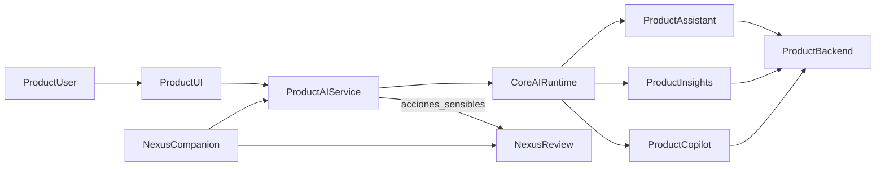

# Ownership IA Ecosistema

Mapa único del sistema IA del ecosistema para evitar mezclar runtime compartido, inteligencia de producto, gobernanza y agente transversal.

## Objetivo

Tratar la IA como **un solo sistema** con múltiples agentes especializados y ownership claro:

- `core` aporta el runtime agnóstico.
- cada producto conserva su inteligencia de negocio.
- `nexus` conserva gobernanza y el empleado IA transversal.
- `modules` solo aloja piezas reusables de app/UI/SDK, no cerebro de negocio.

## Arquitectura objetivo

## Reglas de ubicación

| Capa | Qué vive ahí | Qué no vive ahí |
|------|---------------|-----------------|
| `../../core` | providers, orchestrator, routing/planning base, tipos de mensajes/tool calls, registry de agentes, memoria base, resiliencia y observabilidad reusable | prompts de negocio, agentes `ventas/clientes/compras`, insights de producto, policies de negocio |
| `ai/` de cada producto | assistant, insight, copilot, prompts, tools, handlers HTTP al backend del producto, persistencia conversacional y de insights | runtime reusable agnóstico, governance transversal |
| `../../nexus` | review, governance, approvals, audit y `companion` como empleado IA transversal gobernado | assistant embebido de un producto específico |
| `../../modules` | chat UI reusable, SDK TS, hooks SSE, cards/timeline de insights, widgets de aprobación | agentes, prompts, tool handlers, dominio del producto |

## Taxonomía de agentes

| Tipo | Rol | Vive en |
|------|-----|---------|
| `assistant` | ejecuta tareas operativas, consultas y actions de producto | servicio AI del producto |
| `insight` | detecta señales, anomalías y oportunidades; persiste hallazgos | servicio AI del producto |
| `copilot` | explica insights, responde `why`, propone `next_steps` | servicio AI del producto |
| `companion` | empleado IA transversal que trabaja con varios sistemas bajo governance | `nexus` |

## Estado actual del ecosistema

### `pymes`

Fuente de verdad del servicio: [`ai/src/main.py`](../ai/src/main.py).

| Capacidad | Estado actual | Evidencia |
|-----------|---------------|-----------|
| `assistant` | Sí | endpoint canónico `POST /v1/chat/pymes/` en [`ai/src/api/pymes_assistant_router.py`](../ai/src/api/pymes_assistant_router.py) y sub-agentes en [`ai/src/agents/sub_agents/`](../ai/src/agents/sub_agents/) |
| `insight` | Sí, como backend de producto en evolución | endpoints `GET /v1/insights/sales-collections`, `inventory-profit` y `customers-retention` en [`ai/src/insights/router.py`](../ai/src/insights/router.py) y lógica en [`ai/src/insights/service.py`](../ai/src/insights/service.py) |
| `copilot` | No como producto separado | no hay rutas `copilot/*` ni explainers dedicados |
| integración con governance | Sí, opcional | `ReviewClient` + callback en [`ai/src/main.py`](../ai/src/main.py) y [`ai/src/api/review_callback.py`](../ai/src/api/review_callback.py) |

### `ponti`

Fuente de verdad: [`../../ponti/ponti-ai/app/main.py`](../../ponti/ponti-ai/app/main.py).

| Capacidad | Estado actual | Evidencia |
|-----------|---------------|-----------|
| `insight` | Sí | `POST /v1/insights/compute`, `GET /v1/insights/summary`, etc. en [`../../ponti/ponti-ai/docs/SERVICE_OVERVIEW.md`](../../ponti/ponti-ai/docs/SERVICE_OVERVIEW.md) |
| `copilot` | Sí | `GET /v1/copilot/insights/{id}/explain`, `why`, `next-steps` en [`../../ponti/ponti-ai/docs/SERVICE_OVERVIEW.md`](../../ponti/ponti-ai/docs/SERVICE_OVERVIEW.md) |
| `assistant` | No como assistant operativo general | el foco actual está en insights + explainability acotada por insight |

### `nexus`

Fuentes de verdad: [`../../nexus/v3/doc/NEXUS_ECOSYSTEM_DESIGN.md`](../../nexus/v3/doc/NEXUS_ECOSYSTEM_DESIGN.md) y [`../../nexus/v3/doc/NEXUS_COWORKER_VISION.md`](../../nexus/v3/doc/NEXUS_COWORKER_VISION.md).

| Capacidad | Estado actual | Evidencia |
|-----------|---------------|-----------|
| `review` / governance | Sí | review es el núcleo soberano de decisión y auditoría |
| `companion` | Sí, como runtime task-centric gobernado | Companion orquesta tareas y depende de Review para acciones sensibles |
| assistant de producto | No | Companion no reemplaza la inteligencia embebida de `pymes` o `ponti` |

### `modules`

Fuente de verdad: [`../../modules/README.md`](../../modules/README.md).

| Capacidad | Estado actual |
|-----------|---------------|
| runtime AI | No |
| reusable app pieces | Sí, hoy centrado en `crud/` |

## Qué ya está bien ubicado

- runtime multi-agente reusable en [`../../core/ai/python/src/runtime/`](../../core/ai/python/src/runtime/)
- assistant de `pymes` en `ai/`
- insights de `pymes` en [`ai/src/insights/`](../ai/src/insights/)
- insights y copilot de `ponti` en `ponti-ai`
- governance y companion en `nexus`
- módulos reutilizables de app en `modules`

## Qué sigue ambiguo o transicional

- `pymes` todavía mezcla varios entrypoints de chat (`/v1/chat`, `/v1/chat/commercial/*`, `/v1/chat/pymes/`) dentro de un mismo servicio AI.
- `pymes` ya separó `insight` como backend de producto, pero todavía no tiene superficie dedicada en frontend ni una capa `copilot` encima de esos insights.
- `pymes` puede apoyarse en `Review`, pero todavía no está definido un catálogo final de acciones que obligan governance.
- parte de la documentación todavía referencia `pymes-core/shared/ai`, pero la base reusable efectiva hoy está en [`../../core/ai/python/src/runtime/`](../../core/ai/python/src/runtime/).

## Decisión de ownership para seguir construyendo

### Lo próximo en `pymes`

- estabilizar `assistant`
- conectar `insights` a una superficie de producto en frontend
- diseñar `copilot` propio encima de insights

### Lo próximo en `nexus`

- seguir evolucionando `companion` como empleado IA transversal
- mantener `review` como cerebro soberano

### Lo que no se debe hacer

- mover agentes de negocio a `core`
- meter prompts o handlers de producto en `modules`
- usar `companion` como reemplazo del assistant embebido de `pymes`

## Roadmap recomendado

1. estabilizar `assistant` de `pymes` sobre el runtime ya consolidado
2. consolidar `insights` de `pymes` como producto visible y persistente
3. diseñar `copilot` de `pymes` encima de insights
4. definir acciones sensibles que pasan por `Nexus Review`
5. mantener `Companion` en `nexus` como agente transversal que consume productos, no como assistant de producto

## Regla simple de decisión

- si es **agnóstico** entre productos: `core`
- si es **inteligencia de negocio** de un producto: servicio AI del producto
- si es **gobernanza / approvals / audit**: `nexus`
- si es **UI o SDK reusable** sin dominio: `modules`
