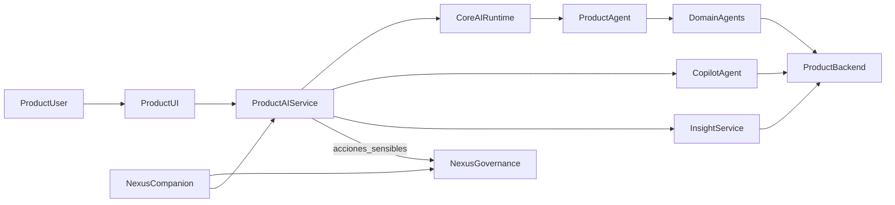

# Ownership IA Ecosistema

Mapa único del sistema IA del ecosistema para evitar mezclar runtime reusable, agentes de producto y servicios transversales.

## Objetivo

Tratar la IA como **un solo sistema** con categorías canónicas y ownership claro:

- `core` aporta el runtime agnóstico.
- cada producto conserva su inteligencia de negocio.
- `nexus` conserva gobernanza y el empleado IA transversal.
- `modules` solo aloja piezas reusables de app/UI/SDK, no cerebro de negocio.

## Arquitectura objetivo

## Reglas de ubicación

| Capa | Qué vive ahí | Qué no vive ahí |
|------|---------------|-----------------|
| `../../core` | runtime agnóstico reusable: providers, orchestrator base, routing/planning base, tipos de mensajes/tool calls, memoria base, resiliencia y observabilidad | prompts de negocio, `ProductAgent`, `DomainAgent`, `CopilotAgent`, `InsightService`, policies de producto |
| `ai/` de cada producto | inteligencia de producto: `ProductAgent`, `DomainAgent`, `CopilotAgent`, `InsightService`, prompts, tools, handlers HTTP al backend del producto, persistencia conversacional y de insights | runtime reusable agnóstico, governance transversal |
| `../../nexus` | `GovernanceService`, approvals, audit y `Companion` como nombre comercial del `ProductAgent` transversal gobernado | agentes embebidos de un producto específico |
| `../../modules` | chat UI reusable, SDK TS, hooks SSE, cards/timeline de insights, widgets de aprobación | agentes, prompts, tool handlers, dominio del producto |

## Categorías generales

| Categoría | Qué agrupa |
|-----------|------------|
| `Agent` | superficies conversacionales o ejecutoras que razonan y actúan con contexto del producto |
| `Service` | capacidades de soporte, análisis, governance u orquestación usadas por agentes o productos |

## Canales de interacción

| Canal / modo | Qué significa | Qué no implica |
|--------------|---------------|----------------|
| `chat interno` | canal conversacional para usuarios internos del negocio | no define por sí solo si responde un `ProductAgent`, un `DomainAgent`, un `CopilotAgent` o una salida determinística |
| `chat externo` | canal conversacional para clientes o contactos externos con superficie acotada | no reemplaza APIs públicas o flujos especializados del producto |
| `streaming` | modo de entrega incremental de la respuesta | no es un canal ni una capacidad de negocio aparte |

Regla práctica:

- el **chat** es un canal de entrada/salida
- el **streaming** es un modo de entrega
- `CopilotAgent` e `InsightService` son **capacidades** del producto, no sinónimos de chat

## Categorías de `Agent`

| Tipo | Rol | Vive en |
|------|-----|---------|
| `ProductAgent` | entrada principal del producto; resuelve pedidos generales y deriva cuando corresponde | servicio AI del producto |
| `DomainAgent` | especialista operativo por dominio (`clientes`, `productos`, `ventas`, `cobros`, `compras`) | servicio AI del producto |
| `CopilotAgent` | explica estados, insights y señales; responde `why` y propone siguientes pasos | servicio AI del producto |

## Categorías de `Service`

| Tipo | Rol | Vive en |
|------|-----|---------|
| `InsightService` | calcula señales, anomalías y oportunidades; persiste hallazgos | servicio AI del producto |
| `PolicyService` | aplica perfiles de canal, permisos y confirmaciones reutilizables | `core` como base reusable + producto dueño para perfiles concretos |
| `OrchestratorService` | coordina runtime, routing técnico y ejecución reusable | `core` |
| `ToolExecutorService` | ejecuta tools y adapters técnicos reusables | `core` |
| `SynthesisService` | genera artefactos LLM batch sobre evidencia o pipeline | producto dueño del pipeline |
| `IntelligenceService` | deriva outputs determinísticos a partir de evidencia técnica | producto dueño de la evidencia |
| `GovernanceService` | decide, audita y aprueba acciones sensibles | `nexus` |

## Contrato runtime canónico

### `Agent` output

- `reply`: texto principal visible al usuario
- `blocks`: salida estructurada reusable para UI
- `tool_calls`: tools ejecutadas o propuestas
- `pending_confirmations`: confirmaciones pendientes antes de actuar
- `content_language`: idioma efectivo del contenido devuelto; puede diferir de `preferred_language` mientras un catálogo todavía no esté implementado
- `routed_agent`: categoría o agente efectivo que resolvió el turno
- `routing_source`: origen del routing (`copilot_agent`, `orchestrator`, `read_fallback`, etc.)

### `Service` output

- `request_id`: identificador de correlación de la operación
- `service_kind`: categoría canónica en formato wire (`insight_service`, `governance_service`, `synthesis_service`, `intelligence_service`)
- `output_kind`: tipo concreto de salida (`chat_reply`, `insight_summary`, `copilot_explanation`, `governance_decision`, `llm_artifact`, etc.) cuando exista un output transversal ya tipificado
- `content_language`: idioma efectivo del artefacto generado
- `policy_profile`: perfil de policy/canal aplicado cuando corresponda
- `policy_version` o `rules_version`: versión de reglas/policy que produjo el resultado

### Observabilidad mínima

- logs y eventos deben poder correlacionarse por `request_id`
- cuando exista routing conversacional, persistir `routed_agent` y `routing_source`
- cuando exista policy, persistir `policy_profile`
- cuando la superficie sea user-facing, registrar `preferred_language` y `content_language`
- cuando exista contexto multi-tenant, incluir `tenant_id`/`org_id` y `user_id`/`actor_id`

### Ubicación canónica actual

- Python reusable: `../../core/ai/python/src/runtime/domain/contracts.py`
- Go reusable: `../../core/ai/go/contracts.go`
- `pymes` consume hoy `routing_source` desde ese contrato shared y mantiene `routed_agent` local mientras termina de estabilizar su catálogo de producto
- el contrato canónico base ya quedó centralizado en `core`; la adopción completa de metadata por superficie sigue como rollout por producto

### Contrato TS para frontends

- la fuente de verdad de DTOs HTTP de AI es el OpenAPI del backend dueño del dominio
- cada frontend genera tipos localmente desde su backend: `../frontend/src/generated/pymes-ai.openapi.ts` y `../../ponti/ponti-frontend/ui/src/generated/ponti-ai.openapi.ts`
- la regeneración hoy se hace con `../frontend/scripts/generate-ai-types.mjs` y `../../ponti/ponti-frontend/ui/scripts/generate-ai-types.mjs`
- `modules` no debe convertirse en owner de contratos TS de negocio entre productos; su scope sigue siendo UI/SDK reusable
- recién conviene evaluar un paquete TS compartido cuando existan contratos realmente idénticos y estables en más de un producto

### Fase 3: assistant-contracts

- `core` sigue siendo owner solo del vocabulario transversal mínimo: `request_id`, `routed_agent`, `routing_source`, `service_kind`, `output_kind`
- ese vocabulario mínimo también incluye `preferred_language` y `content_language` para superficies user-facing
- `preferred_language` pertenece al request/contexto/observabilidad; `content_language` pertenece a los outputs user-facing
- en ese vocabulario, `routed_agent` comparte el nombre de campo pero sus valores válidos siguen siendo catálogo de producto; el único conjunto cerrado transversal hoy es `routing_source`
- `pymes` y `ponti` adoptan ese vocabulario en sus respuestas OpenAPI cuando aplica, pero conservan sus DTOs de producto y sus shapes de negocio
- no se suben a `core` bloques de chat, insights ni payloads específicos de cada producto

### Convención práctica actual

- `pymes` expone `request_id` + `output_kind` + `routed_agent`/`routing_source` en chat y `request_id` + `service_kind` + `output_kind` en notificaciones de insights
- `ponti` expone `request_id` + metadata de `CopilotAgent` en explainability y `request_id` + `service_kind`/`output_kind` solo en las superficies de `InsightService` donde hoy existe un `output_kind` transversal canónico
- `nexus` concentra `GovernanceService`, por lo que su foco contractual principal es decisión, riesgo, auditoría y correlación
- en código histórico todavía pueden aparecer nombres `Review*`; canónicamente esa integración corresponde a `GovernanceService`

## Estado actual del ecosistema

### `pymes`

Fuente de verdad del servicio: [`ai/src/main.py`](../ai/src/main.py).

| Capacidad | Estado actual | Evidencia |
|-----------|---------------|-----------|
| `ProductAgent` | Sí | endpoint canónico `POST /v1/chat` en [`ai/src/api/router.py`](../ai/src/api/router.py) con orquestación principal en [`ai/src/agents/service.py`](../ai/src/agents/service.py) |
| `DomainAgent` | Sí | sub-agentes en [`ai/src/agents/sub_agents/`](../ai/src/agents/sub_agents/) para `clientes`, `productos`, `ventas`, `cobros` y `compras` |
| `CopilotAgent` | Sí, pero por handoff explícito | en `pymes` queda reservado para el flujo `insight -> notification -> copilot -> chat`, disparado explícitamente desde [`ai/src/api/notifications_router.py`](../ai/src/api/notifications_router.py) y resuelto por [`ai/src/agents/copilot_service.py`](../ai/src/agents/copilot_service.py); no debe confundirse con el chat interno corriente |
| `InsightService` | Sí, pero todavía no consolidado como superficie propia visible | endpoint `POST /v1/notifications` en [`ai/src/api/notifications_router.py`](../ai/src/api/notifications_router.py) y lógica en [`ai/src/insights/service.py`](../ai/src/insights/service.py) |
| integración con `GovernanceService` | Sí, opcional | `ReviewClient` + callback en [`ai/src/main.py`](../ai/src/main.py) y [`ai/src/api/review_callback.py`](../ai/src/api/review_callback.py) |

### `ponti`

Fuente de verdad: [`../../ponti/ponti-ai/app/main.py`](../../ponti/ponti-ai/app/main.py).

| Capacidad | Estado actual | Evidencia |
|-----------|---------------|-----------|
| `InsightService` | Sí | `POST /v1/insights/compute`, `GET /v1/insights/summary`, etc. en [`../../ponti/ponti-ai/docs/SERVICE_OVERVIEW.md`](../../ponti/ponti-ai/docs/SERVICE_OVERVIEW.md) |
| `CopilotAgent` | Sí | `GET /v1/copilot/insights/{id}/explain`, `why`, `next-steps` en [`../../ponti/ponti-ai/docs/SERVICE_OVERVIEW.md`](../../ponti/ponti-ai/docs/SERVICE_OVERVIEW.md) |
| `ProductAgent` | No como agente operativo general | el foco actual está en insights + explainability acotada por insight |

### `nexus`

Fuentes de verdad: [`../../nexus/v3/doc/NEXUS_ECOSYSTEM_DESIGN.md`](../../nexus/v3/doc/NEXUS_ECOSYSTEM_DESIGN.md) y [`../../nexus/v3/doc/NEXUS_COWORKER_VISION.md`](../../nexus/v3/doc/NEXUS_COWORKER_VISION.md).

| Capacidad | Estado actual | Evidencia |
|-----------|---------------|-----------|
| `GovernanceService` | Sí | `Nexus Governance` es el núcleo soberano de decisión y auditoría |
| `ProductAgent` transversal | Sí, con nombre comercial `Companion` | Companion orquesta tareas y depende de `GovernanceService` para acciones sensibles |
| agente de producto embebido | No | Companion no reemplaza la inteligencia embebida de `pymes` o `ponti` |

### `toollab`

Fuente de verdad: [`../../toollab/toollab-core/README.md`](../../toollab/toollab-core/README.md).

| Capacidad | Estado actual | Evidencia |
|-----------|---------------|-----------|
| `SynthesisService` | Sí | generación LLM batch en [`../../toollab/toollab-core/internal/llm/usecases.go`](../../toollab/toollab-core/internal/llm/usecases.go) |
| `IntelligenceService` | Sí | derivaciones determinísticas en [`../../toollab/toollab-core/internal/intelligence/usecases.go`](../../toollab/toollab-core/internal/intelligence/usecases.go) |
| assistant conversacional general | No | ToolLab no se modela como `ProductAgent` ni `CopilotAgent` |

### `modules`

Fuente de verdad: [`../../modules/README.md`](../../modules/README.md).

| Capacidad | Estado actual |
|-----------|---------------|
| runtime AI | No |
| reusable app pieces | Sí, hoy centrado en `crud/` |

## Qué ya está bien ubicado

- runtime multi-agente reusable en [`../../core/ai/python/src/runtime/`](../../core/ai/python/src/runtime/)
- `ProductAgent`, `DomainAgent`, `CopilotAgent` e `InsightService` de `pymes` en `ai/`
- `InsightService` y `CopilotAgent` de `ponti` en `ponti-ai`
- `GovernanceService` y `Companion` en `nexus`
- `SynthesisService` e `IntelligenceService` en `toollab`
- módulos reutilizables de app en `modules`

## Qué sigue ambiguo o transicional

- `pymes` ya consolidó el chat interno en `POST /v1/chat`, pero todavía conviven otros canales públicos/especializados en el mismo deployable AI.
- en `pymes`, `chat interno` es hoy el canal conversacional principal; `streaming` debe entenderse solo como modo de entrega y no como un tercer canal.
- el flujo actual del `chat interno` quedó separado en dos carriles:
  - `dato directo`: lectura determinística por dominio (`clientes`, `productos`, `ventas`, `cobros`, `compras`) con bloques estructurados;
  - `interpretación`: lectura determinística + interpretación estructurada vía LLM sobre evidencia factual, sin usar `CopilotAgent`.
- `CopilotAgent` queda fuera del chat corriente y se reserva para el handoff explícito desde notificaciones de insights.
- `InsightService` emite notificaciones factuales; la explicación de esas señales ocurre después, cuando el usuario entra al chat desde la notificación.
- `pymes` puede apoyarse en `Review`, pero todavía no está definido un catálogo final de acciones que obligan governance.
- la documentación principal ya quedó alineada al runtime reusable en [`../../core/ai/python/src/runtime/`](../../core/ai/python/src/runtime/); no reintroducir referencias a `pymes-core/shared/ai`.

## Estado de verificación del rollout

### Evidencia de la última pasada de verificación

- `pymes`: frontend build en Docker OK y contratos TS generados desde OpenAPI del backend dueño
- `ponti`: `pytest` de surface/copilot OK, generación `OpenAPI -> TS` OK y build de UI OK
- `nexus`: `docker compose ps` saludable y smoke `Companion -> Review` OK; naming histórico `Review` documentado como alias de `Nexus Governance`
- `toollab`: `docker compose build` + `up -d` OK, `GET /healthz` OK, `GET /api/v1/targets` OK y `go test ./...` OK; la suite `docs/prompts/` ya refleja `SynthesisService` + `IntelligenceService`
- `core`: tests del contrato Python y Go OK; el vocabulario canónico reusable ya está disponible en `contracts.py` y `contracts.go`

### Gaps reales remanentes

- en `core`, `AIRequestContext` / `RequestContext` ya existe como contrato base, pero su adopción completa en middleware y observabilidad sigue siendo opt-in por producto
- en `pymes`, todavía queda estabilizar una superficie visible propia para `InsightService`, desacoplarla mejor del chat y terminar de ordenar los canales que conviven en el mismo deployable AI
- en `nexus`, `Review` sigue apareciendo como naming histórico en código, variables y parte de la UI; eso es aceptable mientras se mantenga explícita la equivalencia con `GovernanceService`
- en esta pasada no apareció otro gap transversal que justifique extraer más runtime reusable antes de que lo pida un segundo producto

## Decisión de ownership para seguir construyendo

### Lo próximo en `pymes`

- estabilizar `ProductAgent`
- consolidar la separación `chat actual` vs `insight -> notification -> copilot -> chat`
- mantener `InsightService` como productor de señales factuales y `CopilotAgent` como capa explicativa explícita

### Lo próximo en `nexus`

- seguir evolucionando `Companion` como agente transversal
- mantener `GovernanceService` como cerebro soberano

### Lo que no se debe hacer

- mover agentes de negocio a `core`
- meter prompts o handlers de producto en `modules`
- usar `Companion` como reemplazo del `ProductAgent` embebido de `pymes`

## Roadmap recomendado

1. estabilizar `ProductAgent` de `pymes` sobre el runtime ya consolidado
2. consolidar `InsightService` de `pymes` como producto visible y persistente
3. consolidar `CopilotAgent` de `pymes` encima de insights como capa explicativa separada del canal de chat
4. definir acciones sensibles que pasan por `Nexus Governance`
5. mantener `Companion` en `nexus` como agente transversal que consume productos, no como agente embebido de producto

## Regla simple de decisión

- si es **agnóstico** entre productos: `core`
- si es **inteligencia de negocio** de un producto: servicio AI del producto
- si es **gobernanza / approvals / audit**: `nexus`
- si es **UI o SDK reusable** sin dominio: `modules`
