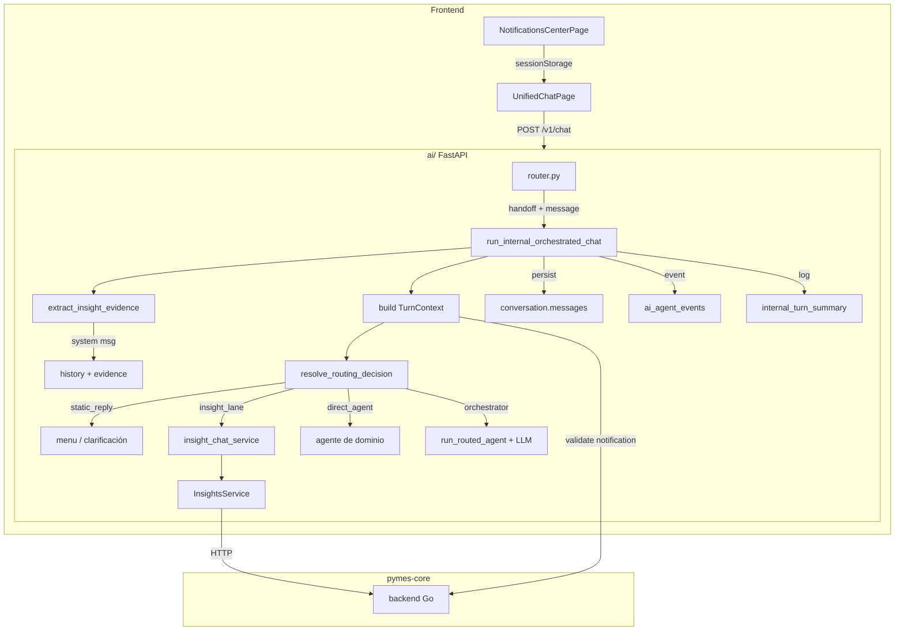
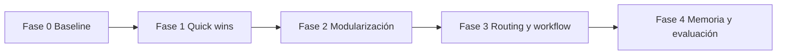

# Evolución del sistema de IA de Pymes

Documento de referencia para alinear **estado actual**, **arquitectura objetivo** y **plan de evolución incremental** del asistente y servicios relacionados. No reemplaza [AI_OWNERSHIP.md](../AI_OWNERSHIP.md) ni [CORE_INTEGRATION.md](../CORE_INTEGRATION.md); los complementa con una hoja de ruta práctica.

---

## 1. Propósito

- Tener **una sola narrativa** de producto y de ingeniería: qué es el asistente, cómo encaja con `pymes-core`, verticales, Nexus y `core`.
- Fijar un **objetivo explícito** (to-be) sin asumir reescritura total del código existente.
- Definir **fases ordenadas** de evolución, con criterios de salida y riesgos, para que el equipo priorice trabajo sin “big bang”.

---

## 2. Principio rector

**Evolucionar hacia el ideal, no reemplazar lo que hay** sin necesidad imperiosa.

- Se mantiene el **servicio `ai/`** (FastAPI), el **chat único** en consola, las integraciones **HTTP** con backends Go y la opción de **governance** vía Nexus donde ya esté cableada.
- Los cambios deben ser **acotados, reversibles y verificables** (tests, compose, contratos).
- Cualquier extracción a la librería **`core`** solo si el código es **agnóstico de Pymes** (ver reglas de ubicación en el repo).

---

## 3. Experiencia de producto (invariantes)

| Invariante | Descripción |
|------------|-------------|
| Chat único | El usuario interno **pregunta en lenguaje natural** desde la consola; no elige entre varios bots visibles. |
| Mismo hilo desde notificaciones | Desde **notificaciones / insights** se abre el **mismo chat** con **contexto inyectado** (`chat_context`, `route_hint`, mensaje sugerido). |
| Routing interno | Por debajo existen **orquestador + sub-agentes** (dominios) y **modo copilot** como rama; el usuario sigue viendo un solo asistente. |

---

## 4. Arquitectura objetivo (to-be)

### 4.1 Capas y responsabilidades

| Capa | Responsabilidad | No debe |
|------|-----------------|--------|
| **`ai/`** | Orquestación LLM, routing, tools como adapters HTTP, persistencia de conversación/dossier propia del servicio IA, cuotas/rate limit observables. | Ser dueña del dominio de negocio ni leer la BD operativa de Pymes directamente. |
| **`pymes-core`** | APIs, datos, RBAC/planes, notificaciones in-app, eventos que disparan avisos, scheduler HTTP batch del control plane. | Empaquetar el runtime del LLM ni duplicar la orquestación de agentes. |
| **Verticales** | Dominio exclusivo expuesto por HTTP. | Importar dominio de otra vertical o del core por código compartido de negocio. |
| **`core` (lib)** | Runtime agnóstico: providers, tipos de mensajes/tool calls, piezas genéricas reutilizables. | Contener prompts, políticas de producto o tools específicas de Pymes. |
| **Nexus** | Governance: aprobaciones, auditoría, callbacks para acciones sensibles. | Reemplazar el dominio en `pymes-core`. |
| **`modules` + `frontend`** | UI, cliente HTTP hacia `ai/` y core, experiencia de chat y notificaciones. | Lógica de negocio duplicada ni “capacidades” que deban vivir solo en backend. |

### 4.2 Agentes (modelo lógico)

- **Un asistente de producto** = **1 orquestador + N sub-agentes** (misma puerta HTTP, misma conversación en UI).
- **Sub-agentes por dominio**: clientes, productos, ventas, compras, etc., con **tools acotadas** y política por rol/plan/canal.
- **Modo copilot**: **rama de routing** (mismo endpoint), activada por contexto de insight/notificación o intención analítica; priorizar **lectura y explicación** sobre mutación.

### 4.3 Delegación (routing)

Orden de prioridad deseado:

1. **Señales deterministas**: `route_hint` desde UI, origen (notificación / vertical / canal interno vs externo), plan, rol, capabilities declaradas.
2. **Heurísticas en código** donde aporten señal fuerte sin costo de LLM.
3. **Clasificación con LLM** solo entre un **conjunto cerrado** de agentes/modos, con salida controlada y logs (`routed_agent`, `routing_source`).
4. **Fallback** seguro (p. ej. agente general o solo lectura según política).

### 4.4 Insights y notificaciones

- **Insights**: pipeline **determinista** (consultas, agregados, reglas) → artefacto estructurado; el LLM **no** es fuente de verdad de números (como mucho redacta sobre datos ya calculados).
- **Notificaciones**: payload con **dato puro** + `chat_context` para continuar en el asistente.
- **Cron / batch**: opcional; solo si el producto promete **avisos programados**. Si no, **eventos en core** + generación **bajo demanda** es suficiente.

### 4.5 Memoria (tres capas)

| Capa | Rol |
|------|-----|
| **Transcript** | Historial completo persistido (auditoría humana, UI, replay). |
| **Ventana para el modelo** | Subconjunto o resumen acotado para contexto del LLM (evitar contexto infinito y costo). |
| **Dossier por org** | Contexto estable y memoria operativa con **schema explícito** y reglas de escritura (qué viene de settings del tenant vs qué puede inferirse del chat; expiración; sin acumular ruido). |

### 4.6 Tools y política

- Cada tool: **contrato operativo** documentado o codificado: read vs write, sensibilidad, confirmación previa, shape de errores, timeouts/retries, idempotencia donde aplique.
- **Policy / capabilities**: fuente de verdad de **qué tools existen** por rol, plan, canal y modo (interno / externo / copilot).

### 4.7 Resiliencia

- Si falla el LLM o el provider: **degradación** a datos deterministas, UI clásica o mensajes fijos; el negocio **no** debe quedar bloqueado solo porque el modelo no respondió.

### 4.8 Disciplina de evolución

- **Journal por turno** (route, tools consideradas/ejecutadas, policy, latencias, errores) y **evaluación/regresión** incremental sobre escenarios críticos — deseable como deuda explícita a mediano plazo.

---

## 5. Estado actual (as-is) — referencias en repo

Puntos de entrada y piezas reales (para profundizar sin duplicar todo el código aquí):

| Tema | Ubicación típica |
|------|-------------------|
| App FastAPI, routers, lifespan, auth | `ai/src/main.py` |
| Chat interno canónico | `ai/src/api/router.py` → `run_internal_orchestrated_chat` en `ai/src/agents/service.py` |
| Carga de conversación interna | `ai/src/agents/service_support.py` (`_load_internal_conversation`) |
| Historial hacia el LLM (ventana) | `ai/src/api/external_chat_support.py` (`history_to_messages` — p. ej. últimos N mensajes) |
| Dossier y memoria operativa | `ai/src/core/dossier.py`, `ai/src/db/repository.py` (`DEFAULT_DOSSIER`, `AIDossier`) |
| Modelos persistencia IA | `ai/src/db/models.py` (`AIConversation`, `AIUsageDaily`, `AIAgentEvent`, …) |
| Copilot / insights en chat | `ai/src/agents/copilot_service.py`, `ai/src/api/notifications_router.py` |
| Tools / registry | `ai/src/tools/registry.py`, `ai/src/tools/*.py`, `ai/src/agents/service_support.py` |
| Review / Nexus (opcional) | `ai/src/main.py` (ReviewClient), `ai/src/api/review_callback.py`, `ai/src/agents/review_gate.py` |
| Frontend chat y notificaciones | `frontend/src/lib/aiApi.ts`, `frontend/src/pages/UnifiedChatPage.tsx`, `frontend/src/pages/NotificationsCenterPage.tsx` |
| Notificaciones in-app / insights negocio | `pymes-core/backend/internal/inappnotifications/`, `pymes-core/backend/internal/businessinsights/` (si existe en la rama), wiring en `pymes-core/backend/wire/bootstrap.go` |
| Scheduler batch control plane | `pymes-core/backend/internal/scheduler/` |
| Ownership ecosistema IA | [docs/AI_OWNERSHIP.md](../AI_OWNERSHIP.md) |
| Contrato consola ↔ IA | [docs/CORE_INTEGRATION.md](../CORE_INTEGRATION.md) |

> **Nota:** La librería `core` y el repo Nexus pueden estar **fuera** del árbol de este monorepo (`replace` en `go.mod`, checkout local). La evolución debe respetar esa realidad y no asumir paths locales.

---

## 6. Brecha (gap) resumida

| Área | As-is (tendencia) | To-be |
|------|-------------------|--------|
| Orquestación | Lógica muy concentrada en `agents/service.py` | Módulos/paquetes claros (ingress, router, policy, tools, memoria, copilot) sin multiplicar deployables |
| Routing | Mezcla de hint UI, heurísticas y LLM | Más determinista al inicio del pipeline; LLM en corredor acotado |
| Workflow multi-turno | Confirmaciones y estado repartidos (conversación, review, pending) | Modelo explícito de “paso de flujo” donde duela primero |
| Tools | Declaraciones y handlers; contrato operativo desigual | Tabla/canónico: read/write, sensibilidad, confirmación, errores, timeouts, idempotencia |
| Dossier | JSON rico con `memory` estructurado | Schema más rígido + reglas de escritura y expiración |
| Nexus | Integración opcional para acciones sensibles | Catálogo explícito de acciones gobernadas + cobertura revisada |
| Evaluación | Observabilidad parcial | Tests de regresión + journal por turno como objetivo |

---

## 7. Fases de evolución

### Fase 0 — Baseline y gobernanza del cambio (siempre primero)

**Objetivo:** saber qué hay sin reescribir.

- Completar o mantener actualizado un documento de **as-is** con evidencia (p. ej. `docs/architecture/pymes-ai-deep-research.md` si se usa el mandato de auditoría).
- Listar **flujos críticos** (chat interno, notificación → chat, tool sensible + review, externo, vertical).
- Congelar criterios: **este documento** + `AI_OWNERSHIP` como referencia de categorías.

**Salida:** mapa aprobado por el equipo, lista de riesgos top 5.

---

### Fase 1 — Quick wins (bajo riesgo)

**Objetivo:** máximo claridad operativa con mínimo cambio de comportamiento.

- Documentar **routing** actual: qué entra por `route_hint`, qué por orquestador LLM, qué por copilot explícito.
- Añadir o endurecer **logs estructurados** en puntos de routing y tool (sin cambiar lógica).
- Priorizar **contrato operativo** para las **10–15 tools más sensibles** (tabla en doc o comentario canónico junto al registry).
- Revisar **degradación** actual ante fallo de LLM (mensajes HTTP, códigos) y documentar “experiencia mínima” real.

**Salida:** tabla de tools “críticas” + diagrama de routing actual en 1 página.

---

### Fase 2 — Modularización interna de `ai/`

**Objetivo:** reducir “god module” **sin** cambiar contratos HTTP ni UX.

- Extraer paquetes/módulos por responsabilidad: p. ej. `internal_routing`, `tool_execution`, `memory_dossier`, `copilot_pipeline` (nombres orientativos).
- Mantener **paridad de tests** (pytest existentes en `ai/tests/`).
- Evitar mover lógica a `frontend` o `modules`.

**Salida:** árbol de módulos acordado; `service.py` como fachada más delgada o desaparece gradualmente.

---

### Fase 3 — Routing y workflow

**Objetivo:** más determinismo y flujos multi-turno explícitos donde hoy falle o sea frágil.

- Implementar **capa de reglas** antes del LLM para casos ya conocidos (notificación, hints, canal).
- Introducir **estado de workflow** mínimo (campos o tabla) para intenciones multi-paso acordadas con producto.
- Alinear con **Nexus**: lista de acciones que **exigen** review vs las que no.

**Salida:** especificación IF/THEN versionada; reducción medible de rutas “solo LLM”.

---

### Fase 4 — Memoria, evaluación y resiliencia de producto

**Objetivo:** dossier predecible y cambios seguros en el tiempo.

- **JSON Schema** (o equivalente) para el dossier o subconjunto `memory`, con migración gradual desde el JSON actual.
- **Journal por turno** persistido o en log agregable para debug y mejora continua.
- **Suite de regresión** (datasets internos pequeños) para routing y tools críticas.
- Endurecer **modo externo**: límites de tools, rate limit, ausencia de memoria sensible.

**Salida:** checklist de regresión en CI o manual obligatoria antes de cambios grandes de prompt/policy.

### Estado actual dentro de Fase 4

Ya implementado en esta rama:

- módulo `ai/src/routing/`
  - `RoutingDecision`
  - `TurnContext`
  - `resolve_routing_decision(...)`
- refactor de `run_internal_orchestrated_chat(...)` para ejecutar una sola decisión de routing
- tests de tabla en `ai/tests/test_routing_pipeline.py`
- log estructurado por turno:
  - `internal_turn_routing_decision`

Orden efectivo actual del pipeline:

1. reglas duras de UI
2. handoff estructurado de insight
3. hint explícito de dominio
4. `insight_chat` legacy con match precomputado
5. orquestador

### Fase 5 — naming: `copilot` → `insight_chat`

Implementado. Tabla de cambios:

| Antes | Después | Dónde |
|-------|---------|-------|
| `COPILOT_AGENT_NAME = "copilot"` | `INSIGHT_CHAT_AGENT_NAME = "insight_chat"` | `catalog.py` |
| `COPILOT_AGENT_NAME` (alias) | Apunta a `INSIGHT_CHAT_AGENT_NAME` | `catalog.py` (deprecado) |
| `"copilot"` en `RoutedAgent`, `ChatRouteHint` | `"insight_chat"` + `"copilot"` (alias deprecado) | `chat_contract.py` |
| `copilot_service.py` | `insight_chat_service.py` | archivo renombrado |
| `CopilotResponse` | `InsightChatResponse` | `insight_chat_service.py` |
| `CopilotInsightMatch` | `InsightChatMatch` | `insight_chat_service.py` |
| `match_copilot_insight_request` | `match_insight_chat_request` | `insight_chat_service.py` |
| `build_copilot_response_for_scope` | `build_insight_chat_response_for_scope` | `insight_chat_service.py` |
| `NotificationChatContext.routed_agent = "copilot"` | `= "insight_chat"` | `notifications_router.py` |
| logs `internal_copilot_*` | `insight_chat_*` | `service.py` |
| Frontend labels "Copilot" | "Análisis" / "Insights" | `aiLabels.ts`, `ai.ts` |
| `route_hint: 'copilot'` (frontend) | `route_hint: 'insight_chat'` | `UnifiedChatPage.tsx` |

**Normalización:** el backend acepta `"copilot"` en `route_hint` y lo normaliza a `"insight_chat"` via `normalize_routed_agent()` en `catalog.py`. Esto garantiza compatibilidad con clientes legacy.

**`routing_source`:** sigue siendo `"copilot_agent"` hasta que `core` migre — el alias `ROUTING_SOURCE_INSIGHT_CHAT_AGENT` apunta al mismo valor.

**Eliminación del alias:** cuando se confirme que ningún cliente envía `"copilot"`, eliminar de `_DEPRECATED_AGENT_ALIASES` y de los Literal types.

### Fase 6 — follow-ups anclados al insight

Implementado. Permite que Turn 2+ en un hilo de insight referencie los datos reales del Turn 1 sin que el usuario reenvíe `handoff`.

**Mecanismo:**

1. `extract_insight_evidence(messages)` busca el `insight_evidence` más reciente en los últimos 10 mensajes del hilo (solo `role=assistant`, TTL 24h).
2. `compact_insight_evidence_for_prompt(evidence)` compacta a JSON (~200-400 tokens): scope, period, summary, kpis (sin key/previous_value), highlights, recommendations. Excluye entity_ids y metadata interna.
3. Se inyecta como `Message(role="system")` al inicio del `history` en `run_internal_orchestrated_chat`, con instrucción "usá solo estos números para follow-ups".

**Flujo ejemplo (3 turnos):**

```
Turn 1: usuario abre insight desde notificación
  → handoff + InsightsService → respuesta con bloques + insight_evidence persisted

Turn 2: usuario pregunta "qué implica eso?" (solo message + chat_id)
  → extract_insight_evidence → compacta → inyecta como system message
  → orchestrator rutea normal → LLM ve los KPIs reales → responde con datos

Turn 3: usuario pregunta "quiénes son los top clientes?"
  → misma evidencia inyectada → LLM responde con datos del snapshot
```

**Política de expiración:**
- TTL: 24 horas (por `computed_at`)
- Ventana: últimos 10 mensajes (alineado con `history_to_messages`)
- Prioridad: el insight más reciente gana
- Sin invalidación explícita

**Archivos:**
- `ai/src/api/external_chat_support.py` — funciones de extracción y compactación
- `ai/src/agents/service.py` — inyección en `run_internal_orchestrated_chat`
- `ai/tests/test_insight_evidence_extraction.py` — 8 unit tests
- `ai/tests/test_pymes_assistant_service.py` — 2 integration tests

### Fase 7 — observabilidad y cierre técnico

Implementado. Cierra el programa de handoff con observabilidad operativa.

**Cambios:**
- Evento `chat.completed` enriquecido con: `routing_reason`, `handler_kind`, `has_handoff`, `handoff_scope`, `has_insight_evidence`, `evidence_injected`
- Log `internal_turn_summary` con todos los campos operativos para dashboards log-based
- Correlación `request_id` verificada (middleware → ContextVar → logs → response body/headers)
- Checklist de regresión manual: `docs/architecture/pymes-ai-regression-checklist.md`
- Runbook de incidentes: `docs/architecture/pymes-ai-runbook.md`

### Fase 8 — sunset: cero legado `copilot`

Implementado. Migración cerrada.

**Eliminado:**
- `"copilot"` de `RoutedAgent`, `ChatRouteHint` (Literals)
- `COPILOT_AGENT_NAME`, `_DEPRECATED_AGENT_ALIASES` de `catalog.py`
- Normalización `"copilot"` → `"insight_chat"` (ya no se acepta)
- Branches `|| mode === 'copilot'` en frontend
- CSS `.cht__msg-badge--copilot`
- i18n key `ai.labels.routed.copilot`
- `"copilot_legacy_match"` → `"insight_chat_legacy_match"` en evidence_source
- `legacy_copilot_request/match` → `legacy_insight_request/match` en TurnContext y routing
- `"legacy_copilot_hint"` → `"legacy_insight_hint"` en routing decisions

**Permanece (viene de `core`):**
- `ROUTING_SOURCE_COPILOT_AGENT = "copilot_agent"` — import de `runtime`; se usa via alias `ROUTING_SOURCE_INSIGHT_CHAT_AGENT`
- `RoutingSource` Literal `"copilot_agent"` — valor definido en core, compartido entre productos
- `conftest.py` stub replica la interfaz de core

**Para eliminar `"copilot_agent"` de core** se necesita un cambio coordinado en `core/ai/python/src/runtime/domain/contracts.py` que afecta todos los productos.

---

## Estado de fases

| Fase | Nombre | Estado |
|------|--------|--------|
| 0 | Baseline (documentación) | Completa |
| 1 | Contrato HTTP (`ChatHandoff`) | Completa |
| 2 | Frontend (handoff desde notificación) | Completa |
| 3 | Backend (anclaje de evidencia) | Completa |
| 4 | Pipeline de routing unificado | Completa |
| 5 | Naming (`copilot` → `insight_chat`) | Completa |
| 6 | Follow-ups anclados al insight | Completa |
| 7 | Observabilidad y cierre técnico | Completa |
| 8 | Sunset: cero legado `copilot` | Completa |

---

## Diagrama as-is post Fase 7



---

## 8. Orden recomendado y dependencias



- **Fase 2** puede empezar en paralelo con partes de **Fase 1** si hay dos personas; el riesgo es divergencia — coordinar por módulo.
- **Fase 3** depende de tener claridad de **Fase 1** (quién decide qué hoy).
- **Fase 4** no bloquea correcciones de seguridad en **Fase 1** (tools sensibles).

---

## 9. Riesgos y mitigaciones

| Riesgo | Mitigación |
|--------|------------|
| Regresiones en chat al refactorizar | Tests existentes + casos manuales documentados; cambios pequeños; feature flags solo si aportan rollback claro |
| Scope creep (“mientras tanto reescribimos X”) | Cada fase con **criterio de salida**; lo que no esté en la fase va a backlog explícito |
| Duplicar dominio en Python | Revisar con [verticals-no-duplication](../../.cursor/rules/verticals-no-duplication.mdc) y [library-placement](../../.cursor/rules/library-placement.mdc) |
| Nexus desalineado con producto | Workshop con seguridad/producto: matriz acción ↔ review obligatoria |
| `core` fuera del repo | Evidencia vía `go.mod` / versión; no asumir APIs sin leer el módulo consumido |

---

## 10. Definición de “hecho” por fase (ejemplos)

- **Fase 1:** tabla de tools críticas publicada; equipo puede responder “qué pasa si falla Gemini” sin leer código.
- **Fase 2:** ningún archivo > N líneas arbitrario sin justificación; imports cíclicos resueltos; tests `ai/tests` en verde.
- **Fase 3:** al menos N flujos documentados con diagrama + comportamiento verificado en compose.
- **Fase 4:** schema de dossier acordado + al menos un test de regresión de routing o tool insensible a cambios de prompt menor.

(Ajustar N según acuerdo del equipo.)

---

## 11. Documentos relacionados

- [AI_OWNERSHIP.md](../AI_OWNERSHIP.md) — categorías Agent/Service, Nexus, modules, core.
- [CORE_INTEGRATION.md](../CORE_INTEGRATION.md) — consola, `VITE_AI_API_URL`, duplicaciones a evitar.
- [ARCHITECTURE.md](../ARCHITECTURE.md) — bordes HTTP entre bounded contexts.
- [DEUDA_TECNICA.md](../DEUDA_TECNICA.md) — deuda consolidada del monorepo (sincronizar ítems de IA si corresponde).

---

## 12. Glosario breve

| Término | Significado en este doc |
|---------|-------------------------|
| Asistente | Superficie única de chat para el usuario interno. |
| Orquestador | Componente que decide delegación (reglas + LLM acotado). |
| Sub-agente | Especialista por dominio con prompt/tools propios. |
| Copilot (modo) | Rama para explicar/conversar sobre insights/notificaciones. |
| Tool | Función invocable por el modelo que ejecuta HTTP (u otro adapter) contra backends. |
| Dossier | JSON por org con contexto de negocio y memoria operativa persistida en el servicio IA. |
| Governance / Nexus | Aprobación y auditoría de acciones sensibles fuera del “sí” del LLM. |

---

*Última actualización: documento inicial de evolución; revisar tras auditoría as-is o cambios mayores en `ai/` o notificaciones.*
