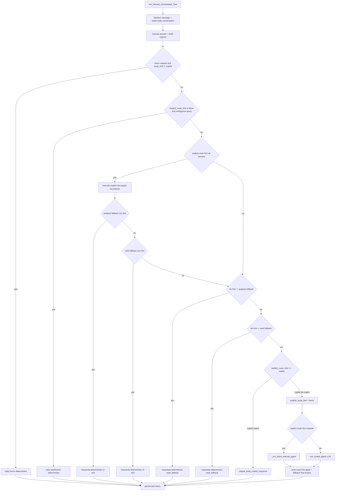
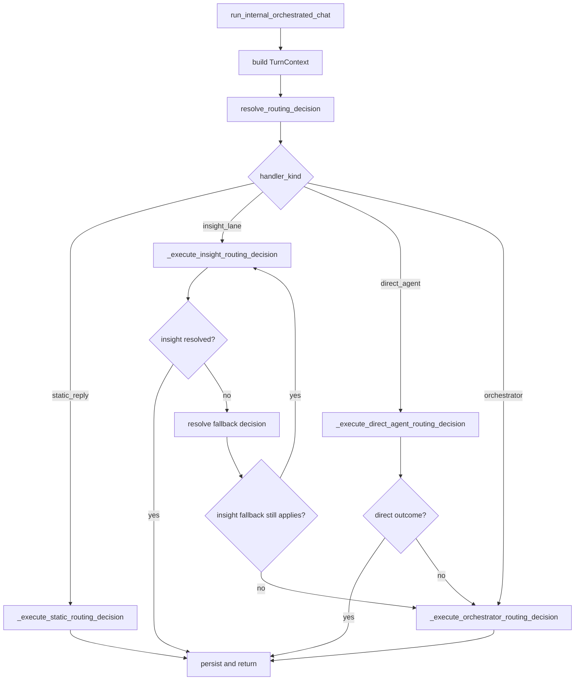

# Pymes AI Chat Handoff Baseline

Baseline de Fase 0 para documentar el estado actual del turno de chat interno y el handoff desde notificaciones de insights, sin cambiar comportamiento productivo.

## 1. Alcance

- Entrypoint HTTP del chat interno: `POST /v1/chat`.
- Flujo backend hasta `run_internal_orchestrated_chat`.
- Handoff frontend desde notificaciones hacia el mismo chat.
- Payload de notificaciones de insights y `chat_context`.
- Orden real de routing actual.
- Persistencia del turno: conversación, dossier, usage y eventos.
- Escenarios mínimos de paridad para fases siguientes.

## 2. Entrypoint del turno

### 2.1 Endpoint y llamada principal

- Router: `ai/src/api/router.py`
- Endpoint: `POST /v1/chat`
- Orquestación principal: `ai/src/agents/service.py` -> `run_internal_orchestrated_chat(...)`

### 2.2 Body actual de `POST /v1/chat`

Definido en `ai/src/api/chat_contract.py` sobre `ChatRequest`:

- `message: string`
- `chat_id: string | null`
  - viene del contrato base `runtime.chat.ChatRequest`
  - se usa como `conversation_id`
- `confirmed_actions: string[] = []`
- `handoff: ChatHandoff | null`
  - agregado en Fase 1 como contexto estructurado opcional
  - en esta fase queda cableado en contrato y propagación interna, sin alterar todavía el routing
- `route_hint: "general" | "copilot" | "customers" | "products" | "services" | "sales" | "collections" | "purchases" | null`
  - el docstring aclara que `copilot` queda reservado para handoff explícito desde notificaciones
- `preferred_language: "es" | "en" | null`

Observación:

- Compatibilidad hacia atrás mantenida: si el cliente no envía `handoff`, el request sigue funcionando igual que en Fase 0.
- Durante la transición siguen soportados `message` + `route_hint` como mecanismo previo.

### 2.2.1 Schema actual de `handoff` (Fase 1)

Definido en `ai/src/api/chat_contract.py` como `ChatHandoff`:

- `source: "in_app_notification" | "direct"`
- `notification_id?: string | null`
  - obligatorio cuando `source == "in_app_notification"`
- `insight_scope?: "sales_collections" | "inventory_profit" | "customers_retention" | null`
- `period?: "today" | "week" | "month" | null`
- `compare?: boolean | null`
- `top_limit?: integer | null`
  - rango válido: `1..10`

Alcance de Fase 1:

- el backend acepta y valida el objeto
- el router lo propaga hasta `run_internal_orchestrated_chat(...)`
- todavía no altera el routing por sí mismo

Ejemplo JSON de request en Fase 1:

```json
{
  "message": "Explicame este insight con más detalle.",
  "chat_id": null,
  "handoff": {
    "source": "in_app_notification",
    "notification_id": "notif-123",
    "insight_scope": "sales_collections",
    "period": "week",
    "compare": true,
    "top_limit": 5
  },
  "route_hint": "copilot",
  "confirmed_actions": [],
  "preferred_language": "es"
}
```

Política transicional de `route_hint`:

- En Fase 2 el frontend ya envía `handoff` estructurado en el primer `POST /v1/chat`.
- Mientras el backend todavía no use `handoff` como fuente primaria de routing, se mantiene temporalmente `route_hint: "copilot"` cuando el handoff proviene del carril legacy de insights.
- Objetivo de la transición:
  - `handoff` pasa a ser el anclaje estable
  - `route_hint: "copilot"` queda solo como alias de compatibilidad hasta que Fase 3/5 lo vuelvan innecesario

### 2.3 Headers relevantes hoy

Usados explícitamente por `chat_internal` en `ai/src/api/router.py`:

- `Accept-Language`
  - se combina con `req.preferred_language` vía `resolve_preferred_language(...)`

Usados implícitamente por dependencias:

- autenticación/autorización resuelta por `get_auth_context`
  - el router no inspecciona headers custom de handoff
  - no hay hoy un header específico para insights/notificaciones

### 2.4 Flujo backend inmediato

Orden observado en `ai/src/api/router.py`:

1. `check_quota(repo, auth.org_id, mode="internal")`
2. log `chat_internal_started`
3. `run_internal_orchestrated_chat(...)` con:
   - `repo`
   - `llm`
   - `backend_client`
   - `org_id`
   - `message`
   - `conversation_id=req.chat_id`
   - `auth`
   - `confirmed_actions=req.confirmed_actions`
   - `route_hint=req.route_hint`
   - `preferred_language`
4. normalización de salida con `normalize_routed_agent(...)` y `normalize_routing_source(...)`
5. respuesta `ChatResponse`

### 2.5 Carga o creación de conversación

En `ai/src/agents/service_support.py`, `_load_internal_conversation(...)`:

- si llega `conversation_id`:
  - busca con `repo.get_conversation(auth.org_id, conversation_id)`
  - exige `mode == "internal"`
  - valida acceso con `can_access_internal_conversation(auth, conversation.user_id)`
  - si falla, responde `404 conversation not found`
- si no llega `conversation_id`:
  - crea una nueva con `repo.create_conversation(...)`
  - `mode="internal"`
  - `user_id=get_internal_conversation_user_id(auth)`
  - `title=message[:60]`

## 3. Handoff de notificación en frontend

### 3.1 Almacenamiento temporal

Archivo: `frontend/src/lib/notificationChatHandoff.ts`

- clave `sessionStorage`: `pymes.notificationChatHandoff`
- shape actual:
  - `notificationId`
  - `title`
  - `body`
  - `chatContext: Record<string, unknown>`
  - `scope?`
  - `routedAgent?`
  - `contentLanguage?`

### 3.2 Construcción del primer mensaje

Función: `buildHandoffUserMessage(...)`

Orden real:

1. si `chatContext.suggested_user_message` es string no vacío, usa eso
2. si no, construye fallback textual:
   - `Necesito más información sobre: {title}\n\n{body}`

Conclusión:

- El texto del primer turno sigue siendo parte de la UX.
- Desde Fase 2 el anclaje estructurado viaja por separado hacia el backend mediante `handoff`.

### 3.3 Flujo desde notificaciones a chat

Archivo: `frontend/src/pages/NotificationsCenterPage.tsx`

En `openInChat(...)`:

1. lee `scope`, `routed_agent`, `content_language` y, si existen, `period`, `compare`, `top_limit` desde `chat_context`
2. arma `NotificationChatHandoff`
3. intenta marcar la notificación como leída
4. persiste el handoff en `sessionStorage`
5. navega a `/chat`

### 3.4 Consumo del handoff en `UnifiedChatPage`

Archivo: `frontend/src/pages/UnifiedChatPage.tsx`

Efecto de arranque:

1. revisa `sessionStorage[NOTIFICATION_CHAT_HANDOFF_KEY]`
2. parsea JSON; si falla, borra la clave
3. marca el handoff como en vuelo
4. setea `skipInitialAiHydrationRef.current = true`
5. evita rehidratar la última conversación guardada
6. borra la clave de `sessionStorage`
7. arma el texto con `buildHandoffUserMessage(handoff)`
8. resetea el hilo AI visible:
   - `setHistoryConversationId(null)`
   - borra `chatIds[AI_PYMES_ID]`
   - borra confirmaciones pendientes
   - borra route hints pegajosos
9. agrega visualmente el primer mensaje del usuario al thread
10. ejecuta `pymesAssistantChat(...)` con:
   - `message: text`
   - `chat_id: null`
   - `confirmed_actions: []`
   - `handoff: buildChatRequestHandoff(handoff)`
   - `route_hint: handoff.routedAgent === "copilot" ? "copilot" : undefined`
   - `preferred_language: resolvePreferredLanguage(handoff.contentLanguage, language)`

Conclusiones:

- El handoff desde notificación siempre abre un hilo nuevo del asistente interno.
- El `chat_id` previo se limpia explícitamente.
- Desde Fase 2 el backend recibe un `handoff` estructurado en el primer `POST /v1/chat`.
- `route_hint: "copilot"` se mantiene temporalmente solo como alias de compatibilidad durante la transición.

### 3.5 Resolución backend del handoff (Fase 3)

Archivo principal: `ai/src/agents/service.py`

Flujo efectivo del primer turno desde insight:

1. `UnifiedChatPage` envía `POST /v1/chat` con:
   - `message`
   - `chat_id: null`
   - `handoff`
   - opcionalmente `route_hint: "copilot"` como alias transicional
2. `run_internal_orchestrated_chat(...)` detecta si el `handoff` representa un insight estructurado
3. si `source == "in_app_notification"`, revalida el `notification_id` contra `GET /v1/in-app-notifications` usando el `auth` actual
4. si la notificación existe para ese `org_id` / actor y `chat_context.scope` coincide:
   - resuelve el insight por `scope`, `period`, `compare`, `top_limit`
   - construye `reply + blocks` con el mismo builder visual del carril legacy
   - registra `handoff_resolved`
5. en paralelo se arma una estructura serializable de evidencia (`InternalInsightEvidence`) con:
   - `notification_id`
   - `scope`
   - `period`
   - `compare`
   - `top_limit`
   - `computed_at`
   - `summary`
   - períodos, KPIs, highlights, recomendaciones y `entity_ids`
6. si la validación o resolución falla:
   - registra `handoff_failed`
   - degrada al comportamiento actual (`route_hint == "copilot"` si aplica; si no, router general)

Diagrama resumido:

```text
notificación in-app
  -> sessionStorage handoff
  -> POST /v1/chat { message, handoff, route_hint? }
  -> run_internal_orchestrated_chat
  -> validate notification_id against /v1/in-app-notifications
  -> build insight snapshot via InsightsService
  -> build reply + blocks
  -> log handoff_resolved
  -> fallback legacy/router if validation or resolution fails
```

Conclusiones de Fase 3:

- El primer turno con `handoff` estructurado ya no depende del keyword match del mensaje.
- El origen factual del insight pasa a ser `scope + params` del handoff revalidado.
- La UX visible del insight se mantiene alineada con el carril legacy (`insight_card`, `kpi_group`, `table`).
- La evidencia del insight ya tiene modelo serializable y queda persistida en `AIConversation.messages[]` dentro del mensaje del asistente bajo `insight_evidence`.

Ejemplo de transición `sessionStorage` -> `POST /v1/chat`:

```json
{
  "sessionStorage.NotificationChatHandoff": {
    "notificationId": "notif-1",
    "source": "in_app_notification",
    "notification_id": "notif-1",
    "insight_scope": "sales_collections",
    "period": "week",
    "compare": true,
    "top_limit": 5,
    "chatContext": {
      "suggested_user_message": "Explicame este insight"
    }
  },
  "post_v1_chat": {
    "message": "Explicame este insight",
    "chat_id": null,
    "handoff": {
      "source": "in_app_notification",
      "notification_id": "notif-1",
      "insight_scope": "sales_collections",
      "period": "week",
      "compare": true,
      "top_limit": 5
    },
    "route_hint": "copilot"
  }
}
```

### 3.5 Rehidratación de hilo existente

También en `UnifiedChatPage.tsx`:

- si no hay handoff pendiente, la pantalla intenta rehidratar la conversación interna más reciente:
  - `listConversations(30)`
  - toma `savedConversations[0]`
  - setea `chatIds[AI_PYMES_ID]` y `historyConversationId`
  - luego hace `getConversation(historyConversationId)`
- si sí hubo handoff, este camino inicial se salta mediante `skipInitialAiHydrationRef`

Esto importa para fases futuras porque el handoff actual no continúa automáticamente un hilo existente: lo reinicia.

## 4. Payload de notificaciones de insights

### 4.1 Endpoint y request

Archivo: `ai/src/api/notifications_router.py`

Endpoint: `POST /v1/notifications`

`NotificationsRequest`:

- `kind: "insight" = "insight"`
- `period: "today" | "week" | "month" = "month"`
- `compare: bool = true`
- `top_limit: int = 5`
- `preferred_language: "es" | "en" | null`

### 4.2 `chat_context` actual

Modelo `NotificationChatContext`:

- `suggested_user_message: string`
- `scope: "sales_collections" | "inventory_profit" | "customers_retention"`
- `routed_agent: "copilot"`
- `content_language: "es" | "en"` con default efectivo `"es"`

### 4.3 Item entregado al cliente

Modelo `NotificationItem`:

- `id`
- `title`
- `body`
- `kind="insight"`
- `entity_type="insight"`
- `entity_id`
- `content_language`
- `chat_context`
- `created_at`

### 4.4 Cómo se construye hoy

En `_build_notification_item(...)`:

- `id` se genera como `insight:{scope}:{period}`
- `entity_id = scope`
- `chat_context.suggested_user_message` se deriva de título + período
- `chat_context.scope` identifica el carril del insight
- `chat_context.routed_agent = "copilot"`

Observación:

- El payload de notificación ya trae una semilla estructurada razonable para anclaje futuro.
- Esa estructura hoy no viaja completa al contrato de `POST /v1/chat`; queda reducida en frontend a texto libre y, opcionalmente, `route_hint: "copilot"`.

## 5. Orden real de ramas de routing

Nota de lectura:

- Las subsecciones 5.1 a 5.4 describen el árbol histórico previo a Fase 4, útil para entender de dónde venimos.
- Desde Fase 4 el turno interno ya no depende de ese árbol disperso: la decisión vive en `ai/src/routing/` y `run_internal_orchestrated_chat(...)` ejecuta una sola `RoutingDecision`.

### 5.1 Resumen ejecutivo

El orden actual en `run_internal_orchestrated_chat(...)` no es "copilot primero". Antes del carril `copilot` hay varios fast paths y heurísticas:

1. menú determinista
2. aclaración determinista
3. override de `route_hint` de dominio
4. fallback determinista de análisis con hint explícito
5. fallback determinista de lectura con hint explícito
6. fallback determinista de análisis sin hint
7. fallback determinista de lectura sin hint
8. recién ahí `route_hint == "copilot"`
9. si nada de eso resolvió, agente directo por hint explícito o router LLM
10. post-procesos y fallback final de lectura

### 5.2 Diagrama simplificado



### 5.3 Tabla de ramas reales

| Orden | Condición | Función / heurística | Resultado |
|------:|-----------|----------------------|-----------|
| 1 | `explicit_route_hint != "copilot"` y `_looks_like_menu_request(...)` | `_build_internal_route_menu(...)` | respuesta determinista, `routed_agent="general"` |
| 2 | `explicit_route_hint is None` y `_looks_like_ambiguous_internal_query(...)` | `_build_internal_route_clarification(...)` | respuesta determinista, `routed_agent="general"` |
| 3 | hint explícito de dominio | `_override_explicit_route_hint(...)` | puede cambiar el hint antes de ejecutar |
| 4 | hint explícito de dominio + análisis | `_looks_like_internal_analysis_request(...)` + `_run_internal_analysis_fallback(...)` | respuesta determinista, `routing_source="ui_hint"` |
| 5 | hint explícito de dominio | `_run_internal_read_fallback(...)` | respuesta determinista, `routing_source="ui_hint"` |
| 6 | sin hint | `_infer_internal_analysis_route(...)` + `_run_internal_analysis_fallback(...)` | respuesta determinista, `routing_source="read_fallback"` |
| 7 | sin hint | `_infer_internal_read_route(...)` + `_run_internal_read_fallback(...)` | respuesta determinista, `routing_source="read_fallback"` |
| 8 | `explicit_route_hint == "copilot"` | `maybe_build_copilot_response(...)` | respuesta de insights; si no matchea, cae al resto |
| 9 | hint explícito restante | `_run_direct_internal_agent(...)` | agente directo LLM + tools, `routing_source="ui_hint"` |
| 10 | sin hint explícito | `run_routed_agent(...)` | orquestador LLM elige sub-agente |
| 11 | post-proceso sin hint | `_apply_internal_route_hint(...)` | puede reinterpretar `general` según heurísticas |
| 12 | post-proceso sin tools ni confirmaciones | `_run_internal_read_fallback(...)` | fallback final determinista de lectura |
| 13 | post-proceso final | menú o aclaración otra vez | solo si siguió en `general` sin tools ni pendientes |

### 5.4 Implicancias del orden actual

- `copilot` no gobierna el pipeline completo; es una rama tardía.
- Con `route_hint` de dominio, muchas consultas nunca llegan al orquestador LLM.
- Incluso sin `route_hint`, varios pedidos de lectura/análisis se resuelven sin LLM.
- El pipeline actual ya mezcla:
- reglas duras
- heurísticas
- respuestas deterministas
- ruteo LLM
- fallback determinista posterior

### 5.5 Estado actual desde Fase 4: pipeline unificado

Módulo nuevo:

- `ai/src/routing/decision.py` -> `RoutingDecision`
- `ai/src/routing/context.py` -> `TurnContext`
- `ai/src/routing/resolve.py` -> `resolve_routing_decision(...)`

Contrato de decisión:

- `handler_kind`
- `target`
- `reason`
- `extras`

Orden efectivo actual:

1. reglas duras de UI (`menu`, aclaración por ambigüedad)
2. handoff estructurado de insight válido
3. hint explícito de dominio
4. hint legacy `copilot` con match precomputado
5. fallback al orquestador

Diagrama actual:



Observaciones:

- `service.py` quedó más delgado: resuelve contexto, pide una decisión y ejecuta una rama.
- El carril de insights ya está unificado:
  - `handoff` estructurado
  - `copilot` legacy por texto
  - ambos convergen en `handler_kind="insight_lane"`
- La decisión queda logueada una vez por turno con `internal_turn_routing_decision`.

## 6. Catálogo `routed_agent` / `routing_source`

### 6.1 Valores declarados

En `ai/src/agents/catalog.py` y en OpenAPI generado:

`routed_agent`

- `general`
- `copilot`
- `customers`
- `products`
- `services`
- `sales`
- `collections`
- `purchases`

`routing_source`

- `copilot_agent`
- `orchestrator`
- `read_fallback`
- `ui_hint`

### 6.2 Relación con comportamiento real

| Valor | Tipo de comportamiento dominante hoy | Evidencia |
|-------|--------------------------------------|----------|
| `general` | agente general / orquestador / menú / aclaración | `run_routed_agent`, `_build_internal_route_menu`, `_build_internal_route_clarification` |
| `copilot` | carril de insight explícito/unificado; respuesta determinista construida por `build_copilot_response_for_scope(...)` | `ai/src/agents/copilot_service.py`, `ai/src/routing/resolve.py`, `run_internal_orchestrated_chat` |
| `customers` | sub-agente de dominio o fallback de lectura/análisis | registry + `_run_direct_internal_agent` o `_run_internal_read_fallback` |
| `products` | idem | idem |
| `services` | idem | idem |
| `sales` | idem | idem |
| `collections` | idem | idem |
| `purchases` | idem | idem |

### 6.3 Lectura correcta de `routing_source`

| `routing_source` | Cuándo aparece realmente |
|------------------|--------------------------|
| `ui_hint` | cuando un `route_hint` explícito define o fuerza el carril efectivo; incluye `copilot` explícito y agentes directos |
| `read_fallback` | cuando una respuesta determinista de lectura/análisis resuelve el turno sin depender del router LLM |
| `orchestrator` | valor por defecto y resultado normal del router LLM cuando no se cambió luego |
| `copilot_agent` | está en el contrato/OpenAPI, pero en `run_internal_orchestrated_chat` actual el carril explícito de copilot se persiste como `ui_hint`, no como `copilot_agent` |

Observación importante:

- Hay una diferencia entre contrato y práctica: el backend interno actual no parece emitir `routing_source="copilot_agent"` en el camino principal documentado; la respuesta de copilot explícito queda marcada como `ui_hint`.

## 7. Persistencia del turno

### 7.1 Conversación y mensajes

Modelo: `ai/src/db/models.py` -> `AIConversation`

Campos relevantes:

- `id`
- `org_id`
- `user_id`
- `mode`
- `title`
- `messages: JSON`
- `tool_calls_count`
- `tokens_input`
- `tokens_output`
- `created_at`
- `updated_at`

Persistencia: `ai/src/db/repository.py` -> `append_messages(...)`

Qué hace:

- concatena `new_messages` a `row.messages`
- incrementa `tool_calls_count`
- acumula `tokens_input` y `tokens_output`
- actualiza `updated_at`
- si falta título, usa el primer mensaje `user`

Cuándo se llama en `run_internal_orchestrated_chat(...)`:

- en todos los early returns:
  - menú
  - aclaración
  - analysis fallback con hint
  - read fallback con hint
  - analysis fallback sin hint
  - read fallback sin hint
- al final del camino general, luego de:
  - copilot explícito
  - agente directo por hint
  - router LLM
  - fallback final

Shape persistido del mensaje assistant interno:

- `role`
- `content`
- `ts`
- `tool_calls`
- `routed_agent`
- `agent_mode`
- `channel`
- `routing_source`
- `pending_confirmations`
- `blocks`

El mensaje user puede incluir además:

- `confirmed_actions`

### 7.2 Ventana hacia el LLM

Función: `ai/src/api/external_chat_support.py` -> `history_to_messages(...)`

- toma `conversation.messages[-10:]`
- filtra solo roles `user`, `assistant`, `tool`
- transforma a `runtime.types.Message`

Uso en chat interno:

- `run_internal_orchestrated_chat(...)` llama `history_to_messages(list(conversation.messages))`
- esa ventana se usa:
  - para `_run_direct_internal_agent(...)`
  - para `run_routed_agent(...)`

Conclusión:

- El transcript persistido es más rico que la ventana enviada al LLM.
- El LLM recibe una proyección acotada de los últimos 10 mensajes.

### 7.3 Dossier y memoria operativa

Modelo: `ai/src/db/models.py` -> `AIDossier`

Repositorio: `ai/src/db/repository.py`

- `DEFAULT_DOSSIER` define el shape base
- `get_or_create_dossier(...)`
- `update_dossier(...)`

Hidratación antes de procesar el turno:

- `run_internal_orchestrated_chat(...)` llama `_hydrate_dossier_from_backend_settings(...)`
- esta función puede sincronizar settings del tenant al dossier y persistir cambios

Memoria del turno:

- helper local: `_remember_internal_turn(...)`
- llama `capture_turn_memory(...)` en `ai/src/core/dossier.py`
- luego `_persist_dossier_if_changed(...)`

Qué captura `capture_turn_memory(...)`:

- `user_id`
- `user_message`
- `assistant_reply`
- `routed_agent`
- `tool_calls`
- `pending_confirmations`
- `confirmed_actions`
- business facts y preferencias inferidas del texto del usuario

Cuándo se llama:

- después de cada persistencia exitosa del turno, tanto en early returns como en el final

### 7.4 Uso diario

Modelo: `ai/src/db/models.py` -> `AIUsageDaily`

Persistencia: `ai/src/db/repository.py` -> `track_usage(...)`

Qué agrega:

- `queries += 1`
- `tokens_input += tokens_in`
- `tokens_output += tokens_out`

Cuándo se llama:

- en cada salida exitosa de `run_internal_orchestrated_chat(...)`
- en `POST /v1/notifications` también se llama con `tokens_in=0`, `tokens_out=0`

### 7.5 Eventos de agente

Modelo: `ai/src/db/models.py` -> `AIAgentEvent`

Persistencia: `ai/src/db/repository.py` -> `record_agent_event(...)`

Wrapper: `ai/src/agents/audit.py` -> `record_agent_event(...)`

Eventos relevantes del turno interno:

- tool sensible bloqueada por confirmación
- tool ejecutada
- `chat.completed`

Metadata típica del `chat.completed`:

- `routing_source`
- `tool_calls`
- `pending_confirmations`

Cuándo se llama:

- después de persistir mensajes, usage y memoria
- en todos los caminos de retorno del turno

## 8. Escenarios mínimos de paridad

Escenarios a preservar en fases 1+:

1. Chat libre sin `route_hint`
   - entra por `POST /v1/chat`
   - puede terminar en orquestador o en `read_fallback`

2. Chat con `route_hint` de dominio
   - ejemplo: `sales`, `customers`, `purchases`
   - debe conservar el carril directo o sus overrides heurísticos actuales

3. Abrir desde notificación de insight
   - frontend guarda handoff en `sessionStorage`
   - chat resetea `chat_id`
   - primer request va con texto sugerido y `route_hint: "copilot"` si corresponde

4. `route_hint="copilot"` sin match
   - `maybe_build_copilot_response(...)` devuelve `None`
   - el backend anula el hint y continúa con el resto del pipeline

5. Hilo existente con `chat_id`
   - el backend debe reusar la conversación interna y cargar historia

6. Menú o aclaración sin LLM
   - siguen siendo respuestas deterministas tempranas

7. Confirmación de acción sensible
   - el turno debe devolver `pending_confirmations`
   - el siguiente request puede usar `confirmed_actions`

## 9. Cobertura actual de tests y huecos

### 9.1 Cobertura existente útil

Backend:

- `ai/tests/test_pymes_assistant_service.py`
  - cubre muchos caminos de `run_internal_orchestrated_chat`
  - incluye:
    - `route_hint` explícito
    - `copilot`
    - `read_fallback`
    - confirmaciones sensibles
    - persistencia de `routed_agent` y `routing_source`
- `ai/tests/test_sse_chat_contract.py`
  - valida contrato HTTP de `POST /v1/chat`
  - valida forwarding de `route_hint`
  - valida normalización de `routed_agent`/`routing_source`
- `ai/tests/test_insights_router.py`
  - valida `POST /v1/notifications`
  - cubre `chat_context.scope`, `chat_context.routed_agent`, `content_language`
- `ai/tests/test_copilot_service.py`
  - cubre matching y respuesta del carril copilot/insights

Frontend:

- `frontend/src/pages/UnifiedChatPage.test.tsx`
- `frontend/src/pages/NotificationsCenterPage.test.tsx`

### 9.2 Huecos de cobertura observables para fases futuras

- no aparece un test frontend/browser realmente extremo a extremo que cubra toda la secuencia:
  - notificación visible en UI
  - guardado en `sessionStorage`
  - navegación real a `/chat`
  - primer `POST /v1/chat`
- no aparece un test de tabla que congele el orden exacto completo del pipeline de routing, incluyendo todos los fast paths previos al carril de insights
- no aparece cobertura de follow-up sobre el mismo hilo iniciado desde notificación

## 10. Hallazgos clave para las siguientes fases

- El sistema ya tiene una sola puerta HTTP y un solo chat visible, y ahora sí tiene contrato estructurado de handoff para `POST /v1/chat`.
- El payload de notificaciones ya se transmite desde frontend al backend de chat como `handoff` estructurado; el texto sugerido quedó relegado a UX y compatibilidad.
- Desde Fase 4 la decisión de routing quedó centralizada en `ai/src/routing/resolve.py`; el árbol histórico del servicio queda documentado como baseline, no como estado vigente.
- `copilot` hoy funciona más como un carril de insights disparado por hint que como un concepto separado de producto, pero su naming sigue filtrándose en contrato, UI y logs.
- `routing_source="copilot_agent"` existe en contrato, pero el camino principal de handoff explícito persiste `ui_hint`, lo que conviene revisar en fases posteriores.
