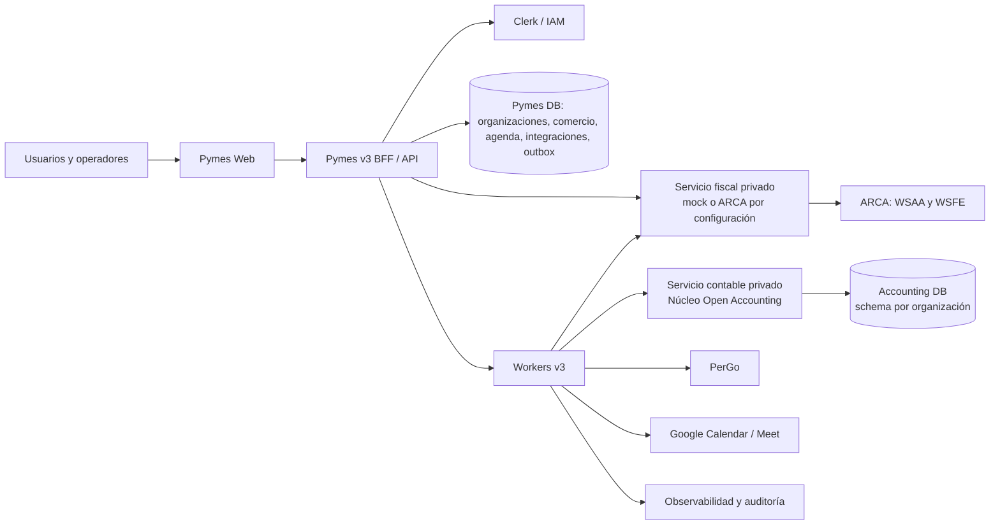
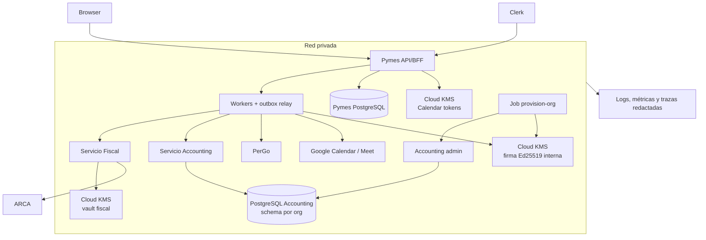
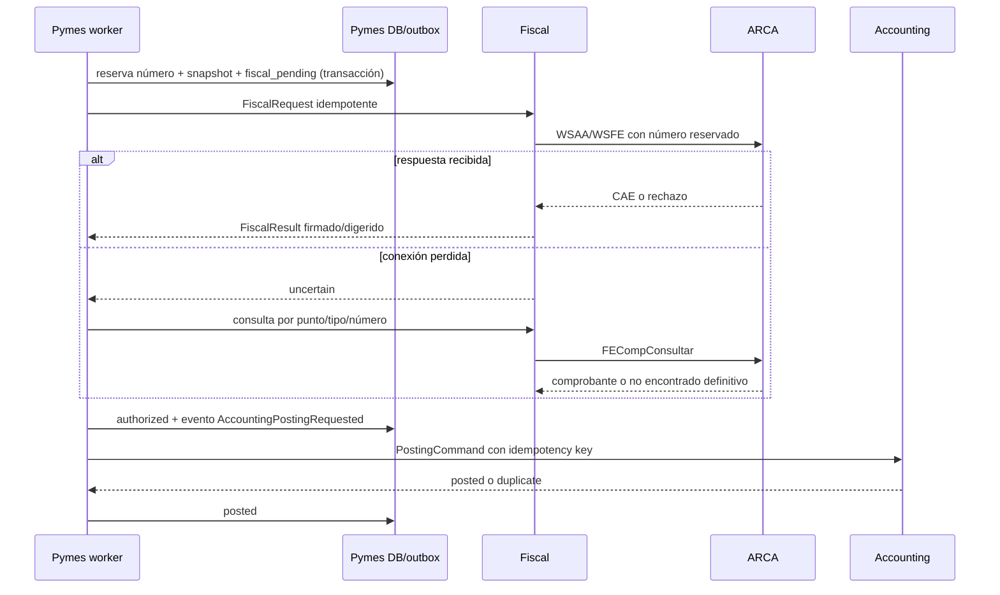

# Arquitectura objetivo

## Contexto y contenedores



Pymes no comparte tablas con los servicios privados. Tiene su propia base y
publica mediante outbox; cada consumidor tiene inbox, clave de idempotencia y
correlation ID. El servicio contable no conoce clientes OAuth, UI ni facturas
completas; recibe un hecho económico balanceado y referencias opacas a la fuente.

> Estado: el mock continúa como modo determinístico de CI y despliegue inicial.
> El servicio Fiscal también implementa onboarding por organización,
> credenciales cifradas, WSAA, WSFE y consulta exacta mediante
> `arca-facturacion`. Esa ruta no se considera operativa hasta completar KMS,
> credenciales de un tenant y homologación.

## Implementación hexagonal actual

```text
v3/backend/
├── cmd/                         # lifecycle: api, worker, provision-org y config
├── wire/                        # única composición concreta
└── internal/
    └── <contexto>/
        ├── handler.go
        ├── handler/{dto,helpers}/
        ├── usecases.go
        ├── usecases/domain/
        ├── repository.go
        ├── repository/{models,helpers}/
        ├── <integracion>.go
        ├── <integracion>/{models,helpers}/
        ├── worker.go
        └── worker/{models,helpers}/

v3/fiscal-adapter/
├── src/cmd/                     # lifecycle del backend privado TypeScript
├── src/wire.ts                  # composición fiscal
├── src/fiscal/                  # dominio, casos de uso y puertos consumidores
├── src/fiscal/handler/          # HTTP privado + models/helpers
├── src/fiscal/repository/       # ledger PostgreSQL + models/helpers
├── src/fiscal/authority/        # mock o ARCA + models/helpers
├── src/credentials/             # vault, KMS y onboarding tenant
└── src/identity/                # JWT Ed25519; bypass sólo local explícito

open-accounting/internal/
├── pymesaccounting/             # dominio, puertos, casos de uso y HTTP privado
├── database/pymesaccounting/    # adapters PostgreSQL runtime y registro read-only
├── database/pymesaccountingadmin/ # DDL/provisionamiento fuera del runtime
└── pymesaccountingadminhttp/    # control plane privado, JWT + Cloud Run IAM
```

Los handlers dependen de puertos de casos de uso; los casos de uso declaran los
puertos de persistencia y proveedores que consumen; cada adapter los implementa
sin filtrar tipos externos al dominio. `wire` es el único lugar que los une.
Axis fue referencia de disposición en modo lectura: Pymes no lo importa,
ejecuta, llama, monta, empaqueta ni necesita en filesystem o red.

## Despliegue



Cada base se respalda, migra y restaura de forma independiente. Accounting sólo
es alcanzable desde workers/API de la red privada; Fiscal es el único workload
que puede resolver una `credential_ref` y conectar con ARCA.
`internal-jwt-signing` no es un servicio ni una clave ARCA: firma identidad
workload→workload. `calendar-tokens` y `fiscal-vault` son claves simétricas
separadas por entorno y uso; el material fiscal sólo es accesible por Fiscal.

## Bounded contexts y fuente única de verdad

| Contexto / entidad | Dueño | Fuente de verdad | Consumidor |
|---|---|---|---|
| Identidad, roles, organización, membresía | Pymes v3 + Clerk | directorio v3 / Clerk | ambos servicios por claim firmado |
| Clave privada de identidad interna | Pymes v3 worker | Cloud KMS Ed25519 por entorno y versión | Fiscal/Accounting reciben sólo JWKS |
| Parties, clientes, proveedores | Pymes v3 | Pymes DB | contabilidad mediante snapshot/ref. |
| Venta, compra, notas A/B/C, adjuntos | Pymes v3 | Pymes DB | fiscal y contabilidad |
| Reserva de punto de venta/tipo/número; estado fiscal; CAE | Pymes v3 | Pymes DB | adaptador fiscal ejecuta, no decide |
| Certificado, clave privada y ticket WSAA | Fiscal Adapter | base Fiscal cifrada con `fiscal-vault` | sólo Fiscal, por `credential_ref` |
| Sucursales, servicios, recursos y turnos | Pymes Scheduling | Pymes DB | Web, Notifications y Calendars mediante casos de uso/eventos |
| Intención de notificación | Pymes Notifications | Pymes DB/outbox | PerGo entrega y devuelve estados |
| Conexión OAuth y mapping de calendario | Pymes Calendars | Pymes DB cifrada | Google mantiene una proyección externa |
| Cobro, pago, medio y conciliación comercial | Pymes v3 | Pymes DB | contabilidad recibe aplicación |
| Plan, cuentas, diarios, asientos, reversas | Servicio contable | Accounting DB | Pymes consulta reportes internos |
| Ejercicio, períodos y bloqueo contable | Servicio contable | Accounting DB | Pymes valida antes de transición |
| Partida abierta y aplicación contable | Servicio contable | Accounting DB | Pymes conserva vínculo comercial |

Una cuenta comercial nunca se muta en Accounting DB, y un asiento nunca se
edita en Pymes DB. Correcciones se representan con documentos/órdenes de
reversa nuevos.

En el borde público, Clerk verifica la sesión y Pymes resuelve una membresía
local activa antes de autorizar. El principal resultante conserva organización,
actor, rol, permisos y estados. `owner`/`admin` pueden mutar únicamente una
organización `ready`; `member`/`viewer` sólo pueden leer. La persistencia repite
el control `ready` dentro de la transacción tenant para evitar que otro adapter
o una carrera de estado eludan el BFF.

## Estados

| Agregado | Estados | Regla decisiva |
|---|---|---|
| Documento de venta | `fiscal_pending → fiscal_uncertain/fiscal_rejected/authorized_pending_posting → posted → partially_paid/paid`; corrección por NC/ND | La creación reserva número y congela snapshot, tipo, punto y número. |
| Solicitud fiscal | `queued → leased → authorizing → authorized/rejected/uncertain → reconciled` | `uncertain` sólo puede salir por consulta exacta, nunca por reemisión. |
| Pago/cobro | `draft → confirmed → applied → reversed` | Confirmar genera un comando de aplicación; revertir genera otro. |
| Orden contable | `received → posted/duplicate/rejected` | `posted` es inmutable; corrección es `reversal`. |
| Período | `open → soft_closed → locked` | `locked` rechaza posteos y reversas ordinarias; ajuste requiere período abierto autorizado. |

## Flujos críticos



Compra, NC/ND, cobro y pago usan el mismo mecanismo: Pymes confirma el
documento comercial en su transacción local, escribe un evento outbox y después
manda una orden inmutable al servicio contable. NC/ND y reversas llevan el
`source_document_ref` original. Un cierre es local al servicio contable y
requiere que no existan órdenes pendientes para el período.

## Consistencia, fallos y recuperación

| Falla | Estado durable | Recuperación |
|---|---|---|
| ARCA procesó, conexión perdida | `uncertain` + número reservado | Consulta exacta; jamás asignar otro número hasta resolver. |
| Accounting posteó, respuesta perdida | comando en vuelo | Reintento con misma clave; responde `duplicate` con mismo asiento. |
| Fiscal/contabilidad caído | evento pendiente y lease vencible | backoff exponencial, jitter y circuit breaker; DLQ sólo tras intervención. |
| Schema no provisionado | `ORG_NOT_PROVISIONED` | no hay fallback de nombre; provisionar explícitamente y reintentar evento. |
| Certificado vencido/no accesible | `CERTIFICATE_UNAVAILABLE` | bloquear emisión, alertar con anticipación, renovar referencia sin exponer clave. |
| Período bloqueado | `PERIOD_LOCKED` | no reintentar ciegamente; generar ajuste autorizado en período abierto. |

Timeouts iniciales: 5 s conexión, 20 s llamada ARCA, 10 s servicio interno;
reintentos sólo para transporte/5xx/`uncertain`, no para rechazos de negocio.
Los logs incluyen IDs, tipo y resultado, nunca XML crudo, CUIT completo,
tokens, certificados ni datos personales innecesarios.

## Credencial interna

JWT Ed25519 de servicio de vida máxima 5 minutos. Desarrollo usa una semilla
fija local; producción rechaza esa variable y firma con una versión numérica
explícita de Cloud KMS `EC_SIGN_ED25519`. El arranque comprueba CRC32C, algoritmo,
nombre, clave pública y una firma de desafío. El `kid` es el hash estable de la
clave pública y el JWKS puede contener la clave activa más las anteriores
durante la ventana de rotación. Cloud Run IAM protege además el transporte
privado. Claims:

```json
{"iss":"pymes-v3","aud":"accounting|fiscal","sub":"worker:outbox",
 "org_id":"org_…","actor_id":"usr_…","delegated_actor_id":"usr_…",
 "roles":["service"],"request_id":"req_…","correlation_id":"corr_…",
 "jti":"…","iat":0,"exp":0,"kid":"ed25519-…"}
```

El `org_id` es obligatorio y se compara con el path y el payload. La identidad
del usuario propagada desde el principal local aporta trazabilidad; no cambia
el subject de workload y nunca cruza organización. Dentro de los servicios
privados la autorización sigue siendo de workload y organización.

## Eventos y errores comunes

Eventos comerciales: `FiscalAuthorizationRequested`,
`FiscalAuthorizationUncertain`, `FiscalAuthorized`, `FiscalRejected`,
`AccountingPostingRequested`, `AccountingPosted`,
`AccountingPostingRejected`, `PaymentConfirmed`, `OpenItemApplied`,
`PeriodLocked` y `ReconciliationRequired`.

Agenda publica `BookingCreated`, `BookingUpdated`, `BookingConfirmed`,
`BookingRescheduled`, `BookingCancelled`, `BookingCompleted`, `BookingNoShow`,
`WaitlistOffered`, `ReminderDue`, `CalendarSyncRequested` y
`NotificationRequested`. `BookingUpdated` sólo representa la edición
optimista de datos operativos; horario, servicio, recursos y estado conservan
sus comandos específicos.

Códigos estables: `ORG_NOT_PROVISIONED`, `ORG_SUSPENDED`,
`UNAUTHORIZED_SERVICE`, `IDEMPOTENCY_KEY_REUSED`, `UNBALANCED_POSTING`,
`ACCOUNT_INACTIVE`, `PERIOD_LOCKED`, `SOURCE_ALREADY_POSTED`,
`FISCAL_UNCERTAIN`, `FISCAL_REJECTED`, `AUTHORITY_TIMEOUT`,
`CERTIFICATE_UNAVAILABLE` y `VALIDATION_ERROR`.
